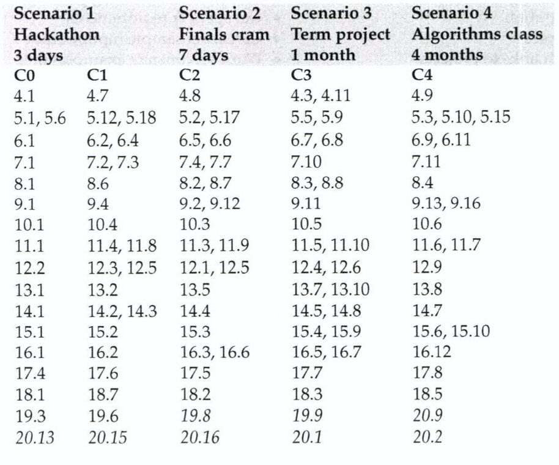

# eopi_solutions
This is a repository jointly held by Arshan Khanifar and Vlad Tkachuk, where we solve the problems of the book 
"Elements of Programming Interviews in Python" 

## Our plan
We first want to start by solving all the problems listed in `Table 1.2` in the book. 
Here is the table for reference:

